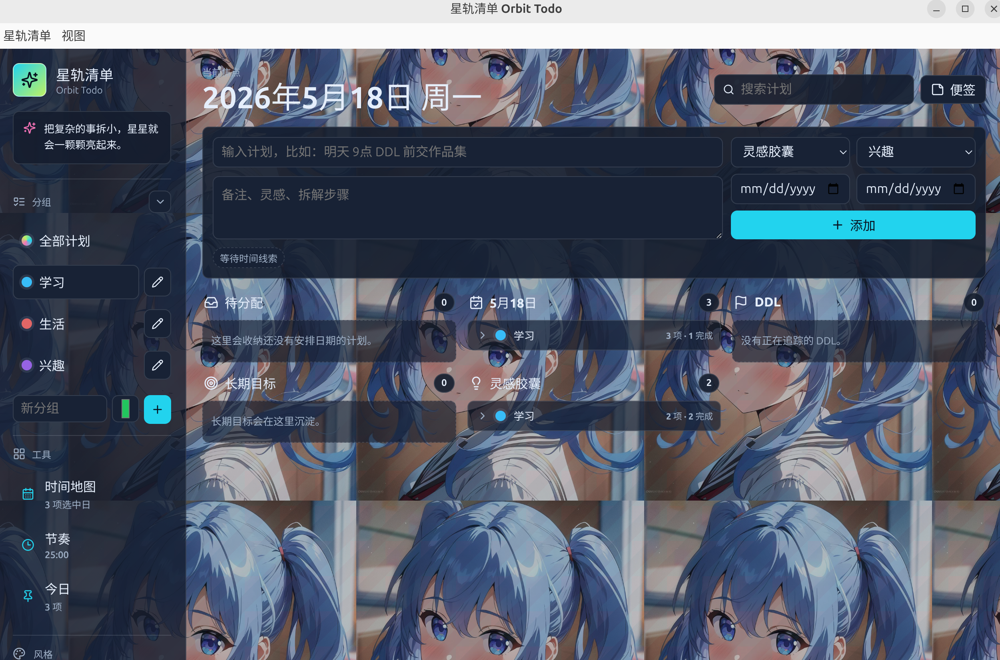

# 星轨清单 Orbit Todo

星轨清单是一个面向 Ubuntu 桌面的创意型 To Do List。它把传统清单、日历、DDL、长期目标、灵感记录、番茄钟和桌面便签组合成一个更活跃的个人计划工作台。

数据默认保存在本机 `localStorage`，不依赖后端服务；桌面版基于 Electron，可通过脚本一键启动。

项目创作原因：本人在使用各种To Do List类的软件过程中，深觉其功能冗杂，UI界面不适合，设计过于传统，部分功能需付费，仅支持Win/Mac。故借助AI开发了这款适合个人使用的To Do List。

**声明：本项目代码完全由GPT-5.5生成**
## 功能特性




- 计划管理：支持待分配、按日期安排、DDL、长期目标、灵感胶囊等任务类型。
- 多分组：支持创建、折叠、重命名、更改颜色和删除分组。
- 时间识别：输入任务时自动提取日期、时间和 DDL 信息，并在任务内容中高亮。
- 日历视图：支持月历和年历，点击日期可查看当天计划，并支持一键回到今天。
- 任务收纳：分组内任务可折叠，任务条默认展示核心内容，点击后展开详细信息。
- 完成记录：用圆角方框勾选任务，完成后保留记录，并支持自定义完成渲染颜色。
- 今日桌面便签：Electron 桌面版中便签独立于主窗口，可拖出应用窗口、自由调整大小、修改背景色和透明度；主窗口最小化不影响便签。
- 番茄钟：内置节奏计时器，支持自定义分钟数。
- 个性化 UI：内置多种主题和纹理，支持自定义主题色、完成色、背景图片、背景大小和透明度。
- 本地数据：自动保存、自动备份，并支持 JSON 导入和导出。

## 环境要求

- Ubuntu 或其他 Linux 桌面环境
- Node.js 18+
- npm

## 一键桌面运行

```bash
chmod +x run.sh
./run.sh
```

`run.sh` 会在首次运行时安装依赖，然后构建前端并打开 Electron 桌面窗口。

## 浏览器开发模式

```bash
chmod +x run_web.sh
./run_web.sh
```

默认地址：

```text
http://localhost:5173
```

浏览器模式适合开发和调试；桌面便签的独立窗口能力需要在 Electron 桌面模式下使用。

## 常用命令

```bash
npm install
npm run web
npm run desktop
npm run build
npm run lint
```

## 安装桌面图标

```bash
chmod +x install_desktop_launcher.sh
./install_desktop_launcher.sh
```

执行后会创建：

- 应用菜单入口：`~/.local/share/applications/orbit-todo.desktop`
- 桌面图标：`~/Desktop/orbit-todo.desktop`

如果桌面环境提示“不受信任的启动器”，右键图标选择允许启动即可。

## 本地数据说明

- 主数据键：`orbit-todo-state-v2`
- 自动备份键：`orbit-todo-state-backup-v2`
- 数据位置：当前 Electron/浏览器用户数据目录中的 `localStorage`
- 导入导出：在应用侧边栏“本地数据”区域使用 JSON 备份功能

本项目当前不上传用户任务数据，也不需要服务器数据库。

## 项目结构

```text
.
├── assets/                     # 应用图标等静态资源
├── electron/                   # Electron 主进程和 preload
├── src/                        # React 前端源码
├── run.sh                      # Ubuntu 桌面版一键运行脚本
├── run_web.sh                  # 浏览器开发模式运行脚本
├── install_desktop_launcher.sh # 安装桌面入口脚本
├── package.json
└── vite.config.ts
```

## 后续发布方向

- GitHub Release：打包 Electron 桌面应用安装包。
- GitHub Pages：发布浏览器预览版。
- 自动化构建：使用 GitHub Actions 执行 `npm run build` 和 `npm run lint`。
